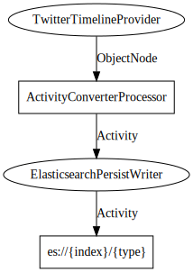

Apache Streams (incubating)
Licensed under Apache License 2.0 - http://www.apache.org/licenses/LICENSE-2.0
--------------------------------------------------------------------------------

twitter-history-elasticsearch
==============================

Requirements:
-------------
 - Authorized Twitter API credentials
 - A running ElasticSearch 1.0.0+ instance

Description:
------------
Retrieves as many posts from a known list of users as twitter API allows.

Converts them to activities, and writes them in activity format to Elasticsearch.

Specification:
-----------------

[TwitterHistoryElasticsearch.dot](src/main/resources/TwitterHistoryElasticsearch.dot "TwitterHistoryElasticsearch.dot" )

Diagram:
-----------------

Example Configuration:
----------------------

    twitter {
        host = "api.twitter.com"
        endpoint = "statuses/user_timeline"
        oauth {
            consumerKey = ""
            consumerSecret = ""
            accessToken = ""
            accessTokenSecret = ""
        }
        info = [
            "42232950"
            "211620426"
        ]
    }
    elasticsearch {
        hosts = [
            localhost
        ]
        port = 9300
        clusterName = elasticsearch
        index = userhistory_activity
        type = activity
    }

In the Twitter section you should place all of your relevant authentication keys and whichever Twitter IDs you want to pull history for.

Twitter IDs can be converted from screennames at http://www.gettwitterid.com

Build:
---------

`mvn clean package verify`

Run:
--------

    java -cp target/twitter-history-elasticsearch-0.2-incubating-SNAPSHOT.jar -Dconfig.file=application.conf org.apache.streams.example.twitter.TwitterHistoryElasticsearch

Deploy:
--------
`mvn -Pdocker clean package docker:build`

`docker tag twitter-history-elasticsearch:0.2-incubating-SNAPSHOT <dockerregistry>:elasticsearch-reindex:0.2-incubating-SNAPSHOT`

`docker push <dockerregistry>:twitter-history-elasticsearch:0.2-incubating-SNAPSHOT`

`docker run <dockerregistry>:twitter-history-elasticsearch:0.2-incubating-SNAPSHOT.jar java -cp twitter-history-elasticsearch-0.2-incubating-SNAPSHOT.jar -Dconfig.file=http://<location_of_config_file>.json org.apache.streams.example.twitter.TwitterHistoryElasticsearch`
